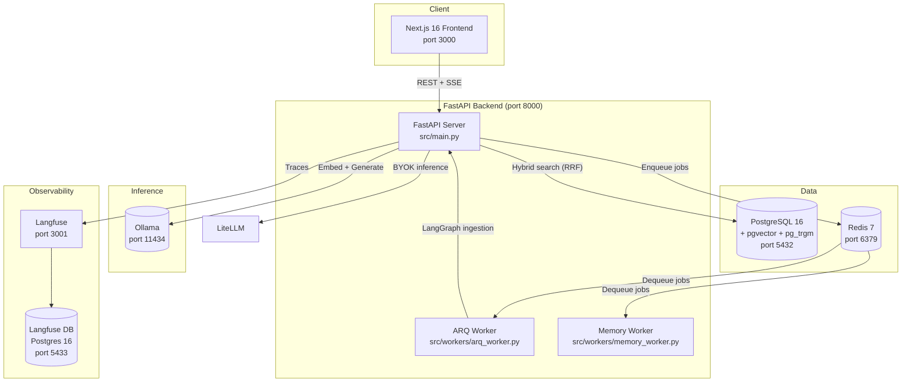
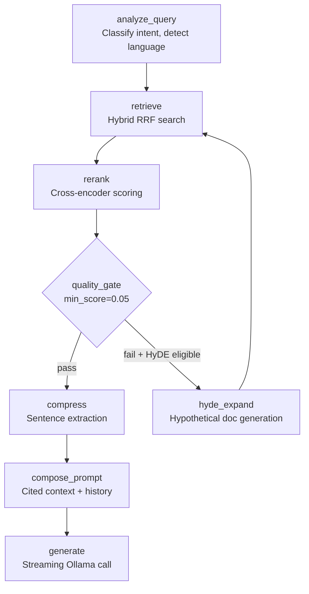
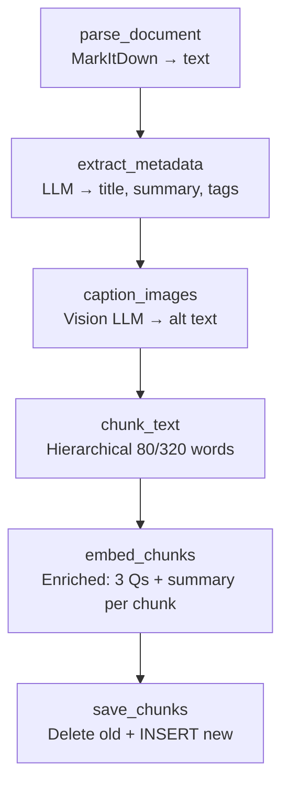
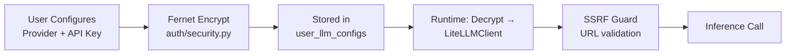

# System Architecture & Technical Design

This document is the authoritative reference for Artha's system architecture. All other documentation derives from this. If something here conflicts with another doc, this doc wins.

---

## 1. System Context & Philosophy

Artha is a **local-first, autonomous RAG stack** — no external API dependencies, no data leaves the machine. Users upload documents (PDF, DOCX, images, code, etc.), the system ingests them into a vector-indexed knowledge base, and users ask questions via a streaming chat interface. Every answer cites sources.

**Key architectural tenets:**
- **Local-first by default** — all inference via Ollama on the host machine. BYOK (Bring Your Own Key) for users who want cloud LLMs.
- **Single-database strategy** — PostgreSQL + pgvector for both relational data and vector embeddings. Avoids sync bugs between separate stores.
- **Async ingestion** — document parsing, chunking, and embedding are offloaded to ARQ background workers so the API never blocks.
- **LangGraph state machines** — both RAG and ingestion are explicit, observable state machines, not opaque chains.
- **Clean Architecture layering** — Router → Service → Repository separation for testability.

---

## 2. Container Architecture



---

## 3. Technology Stack

| Layer | Technology | Version | Rationale |
|---|---|---|---|
| Frontend | Next.js | 16 (React 19) | App Router, Server Components, SSE streaming |
| Frontend UI | Tailwind CSS | 4 | Utility-first, dark/light themes |
| Frontend Components | shadcn/ui | latest | Accessible primitives, no design debt |
| Backend | FastAPI | ≥0.115 | Async-native, Pydantic validation |
| Backend Python | Python | 3.12 | Current stable |
| Backend ORM | SQLAlchemy | 2.0 (async) | Mature async ORM |
| Database | PostgreSQL | 16 | pgvector + pg_trgm + pg_bm25 extensions |
| Vector Index | IVFFlat | lists=100 | Cosine distance, 1024d embeddings |
| Cache/Queue | Redis | 7 | ARQ job queue + JWT revocation + caching |
| LLM Inference | Ollama | latest | Local-first inference |
| Embeddings | sentence-transformers | via Ollama | 1024d, all-MiniLM-L6-v2 based |
| LLM Gateway | LiteLLM | latest | 100+ provider interface for BYOK |
| Agent Framework | LangGraph | ≥0.2 | State machines, not chains |
| Background Jobs | ARQ | ≥0.26 | Redis-based async job queue |
| Observability | Langfuse | v2 | LLM tracing, token counting |
| Auth Hashing | Argon2id | via passlib[bcrypt] | time_cost=3, memory_cost=65536, parallelism=4 |
| Auth Tokens | JWT (HS256) | via PyJWT | 30min access, 7d refresh with JTI revocation |
| Encryption | Fernet (symmetric) | via cryptography | BYOK API key encryption |

---

## 4. Backend Structure (Clean Architecture)

```
backend/src/
├── main.py                 # FastAPI app factory, middleware, lifespan
├── core/
│   ├── config.py           # Settings (all env vars, tunable constants)
│   ├── database.py         # AsyncSession factory, get_db dependency
│   └── redis_client.py     # Redis connection pool
├── domain/
│   └── models.py           # All SQLAlchemy ORM models
├── schemas/                # Pydantic schemas (request/response)
├── routers/                # FastAPI APIRouter modules
│   ├── auth.py             # /api/auth/* (register, login, token refresh, password)
│   ├── projects.py         # /api/projects/*
│   ├── documents.py        # /api/projects/{id}/documents/*
│   ├── chat.py             # /api/projects/{id}/chat (SSE streaming)
│   ├── llm.py              # /api/llm/* (BYOK provider config)
│   ├── memory.py           # /api/memory/* (user memory CRUD)
│   └── templates.py        # /api/templates/* (document templates)
├── services/               # Business logic
│   ├── ollama.py           # OllamaClient (embed, generate, stream, vision)
│   ├── llm_client.py       # BaseLLMClient + LiteLLMClient + SSRF guard
│   ├── llm_factory.py      # Fernet key encryption, per-user provider resolution
│   ├── reranker.py         # Cross-encoder reranker + context compression
│   ├── ingestion.py        # Document parsing (MarkItDown), hierarchical chunking
│   ├── vision.py           # Image captioning via Ollama vision models
│   └── idp_parser.py       # Intelligent Document Processing (tables, forms)
├── agents/
│   ├── rag.py              # RAG LangGraph state machine
│   └── ingestion.py        # Ingestion LangGraph state machine
├── repositories/           # Data access layer
│   ├── base.py             # BaseRepository (get_for_user pattern)
│   ├── users.py
│   ├── projects.py
│   ├── documents.py        # Hybrid search (RRF), chunk replacement
│   ├── conversations.py
│   └── llm_configs.py
├── auth/
│   ├── security.py         # Argon2id hashing, JWT, Fernet encryption
│   └── dependencies.py     # get_current_user, rate limit dependencies
└── workers/
    ├── arq_worker.py       # process_document job
    └── memory_worker.py    # Periodic memory maintenance
```

---

## 5. Frontend Structure

```
frontend/
├── app/
│   ├── layout.tsx          # Root layout (ThemeProvider, Toaster)
│   ├── page.tsx            # Landing / auth entry
│   ├── (auth)/             # Login/register route group
│   └── workspace/          # Authenticated routes
│       └── [projectId]/    # Dynamic project routes
│           ├── page.tsx    # Project default view
│           ├── documents/  # Document management
│           └── chat/       # Streaming chat interface
├── components/
│   ├── ui/                 # shadcn/ui primitives
│   ├── app/                # Feature components (chat, documents, projects)
│   └── layout/             # Sidebar, navbar, workspace shell
├── lib/
│   ├── api.ts              # apiFetch wrapper (JWT injection, error handling)
│   ├── chat-stream.ts      # SSE stream parser
│   └── utils.ts            # cn(), formatBytes(), etc.
```

---

## 6. Data Flow Sequences

### 6a. Document Ingestion

```mermaid
sequenceDiagram
    autonumber
    participant U as User (browser)
    participant FE as Next.js
    participant API as FastAPI
    participant R as Redis
    participant W as ARQ Worker
    participant LG as agents/ingestion.py (LangGraph)
    participant SVC as services/ingestion.py
    participant OL as Ollama
    participant PG as PostgreSQL

    U->>FE: Upload file
    FE->>API: POST /api/projects/{id}/documents (multipart)
    API->>PG: INSERT document (status=pending)
    API->>R: enqueue_job process_document(id)
    API-->>FE: 202 + DocumentRead
    FE->>FE: Poll for status changes

    R->>W: Dequeue job
    W->>PG: UPDATE status=processing
    W->>LG: ainvoke({source_bytes, document_id})

    rect rgb(40,40,40)
        Note over LG,OL: LangGraph Ingestion Pipeline
        LG->>SVC: parse_document_bytes (MarkItDown) → text
        LG->>OL: generate(title, summary, tags) — metadata enrichment
        LG->>SVC: chunk_text_hierarchical (80/320 words)
        LG->>SVC: embed_chunks_enriched (3 hypothetical Qs + summary per chunk)
        SVC->>OL: embed(chunk) — 1024d vector
    end

    LG-->>W: {metadata, chunks, enriched_embeddings}
    W->>PG: replace_chunks (DELETE old + INSERT new)
    W->>PG: UPDATE status=completed
    FE->>PG: Poll detects status=completed
```



### 6b. Chat / RAG Query

```mermaid
sequenceDiagram
    autonumber
    participant U as User
    participant FE as Next.js
    participant API as FastAPI
    participant CR as ConversationRepo
    participant RAG as agents/rag.py (LangGraph)
    participant DR as DocumentRepository
    participant RR as Reranker
    participant OL as Ollama

    U->>FE: Submit question
    FE->>API: POST /api/projects/{id}/chat + Bearer JWT
    API->>CR: add_message(role=user)
    API-->>FE: StreamingResponse (text/event-stream)

    API->>RAG: ainvoke({question, project_id, conversation_id})

    rect rgb(40,40,40)
        Note over RAG,OL: RAG State Machine
        RAG->>OL: embed(question) → 1024d vector
        RAG->>DR: hybrid_search (RRF: cosine + trigram + BM25)
        RAG->>RR: rerank(top-20) → scored list
        RAG->>RAG: quality_gate(min_score=0.05)
        alt score < 0.05 AND needs HyDE
            RAG->>OL: generate hypothetical document
            RAG->>DR: search again with HyDE embedding
        end
        RAG->>RR: compress_chunk (extract relevant sentences)
        RAG->>RAG: compose_prompt (cited [1]..[N])
    end

    RAG-->>API: {prompt, sources}
    API-->>FE: event: sources [...]

    API->>OL: stream_generate(prompt)
    loop For each token
        OL-->>API: token
        API-->>FE: event: token "text"
    end

    API->>CR: add_message(role=assistant, sources)
    API-->>FE: event: final
```



---

## 7. Database Schema (ORM Models)

All models defined in `backend/src/domain/models.py`. Key entities:

| Model | Purpose | Key Fields |
|---|---|---|
| User | Identity | id (UUID), email, hashed_password (Argon2id), full_name |
| Project | Scoping container | id, owner_id (FK→User), name, system_prompt |
| Document | File metadata | id, project_id (FK→Project), filename, mime_type, sha256, status |
| DocumentChunk | Vector-embedded segment | id, document_id (FK→Doc), content, parent_context, embedding (1024d), chunk_index, parent_chunk_index, enriched_embedding (1024d) |
| Conversation | Chat session | id, project_id (FK→Project), title |
| Message | Chat exchange | id, conversation_id (FK→Conv), role, content, metadata (JSON), feedback |
| UserLLMConfig | BYOK provider config | id, user_id (FK→User), provider, model, api_key (Fernet encrypted), base_url |
| UserMemory | Cross-session memory | id, user_id (FK→User), key, value (JSONB), type, expires_at |
| DocumentTemplate | Ingestion templates | id, user_id (FK→User), name, schema (JSON), extraction_rules |
| SchemaMapping | Field mappings | id, template_id (FK→Template), source_field, target_field, transform |
| GeneratedVideo | Video output metadata | id, user_id (FK→User), status, script (JSON), assets (JSON) |

**Indexes:**
- IVFFlat on `DocumentChunk.embedding` (1024d, vector_cosine_ops, lists=100)
- pg_trgm GIN index on `DocumentChunk.content` for trigram-based full-text search
- Unique index on `Document.sha256` for deduplication
- Composite index on `DocumentChunk(document_id, chunk_index)`

**Critical rule:** `infra/init-db.sql` MUST be run before first migration. It creates the required PostgreSQL extensions.

---

## 8. API Architecture

All endpoints live under `/api/`. Auth is enforced via `auth/dependencies.get_current_user` (JWT bearer token).

| Router | Prefix | Key Endpoints | Auth |
|---|---|---|---|
| auth | `/api/auth` | POST register, POST login, POST refresh, POST change-password, POST forgot-password | Mixed (public routes + JWT) |
| projects | `/api/projects` | CRUD for projects | JWT |
| documents | `/api/projects/{id}/documents` | Upload, list, get, delete documents | JWT |
| chat | `/api/projects/{id}/chat` | POST (SSE streaming response) | JWT |
| llm | `/api/llm` | CRUD for per-provider LLM configs | JWT |
| memory | `/api/memory` | CRUD for user memory items | JWT |
| templates | `/api/templates` | CRUD for document templates | JWT |

**SSE Protocol (chat):**
```
event: sources
data: [{"chunk_id": "...", "content": "...", "score": 0.92}, ...]

event: token
data: "streamed text fragment"

event: final
data: {"message_id": "...", "usage": {...}}
```

**Rate Limits:**
- register: 5/min, login: 10/min, chat: 20/min, change-password: 5/min, forgot-password: 3/min

---

## 9. Auth & Authorization

### Password Hashing
- Algorithm: Argon2id via `passlib.hash.argon2`
- Parameters: `time_cost=3, memory_cost=65536, parallelism=4`
- Implementation: `auth/security.py`

### JWT Tokens
- Algorithm: HS256
- Access token: 30min TTL
- Refresh token: 7d TTL with Redis-backed JTI revocation (logout invalidates)
- Key: `SECRET_KEY` from env (256-bit minimum recommended)

### Per-User Authorization
- Repository pattern enforces `get_for_user(user_id)` — every query filters by ownership
- No user can access another user's projects, documents, conversations, or LLM configs

### BYOK Encryption
- API keys stored encrypted at rest using Fernet (symmetric authenticated encryption)
- Optional `BYOK_MASTER_KEY` env var for key rotation support
- Decrypted only at runtime when making inference calls

---

## 10. RAG Pipeline (LangGraph)

### Graph topology (`agents/rag.py`):



### State Fields
- `question: str` — user input
- `conversation_id: UUID` — for history injection
- `project_id: UUID` — document scope
- `sources: list[DocumentChunkRead]` — retrieved + reranked chunks
- `prompt: str` — composed prompt with `[1]..[N]` citations
- `response: str` — accumulated streamed response

### Quality Gate
- `relevance_threshold=0.05` (configurable via `settings.reranker_relevance_threshold`)
- If max reranker score < threshold AND query is answerable → HyDE fallback
- If max reranker score < threshold AND query is not answerable → return "I don't know"

### Hybrid Search Strategy (RRF)
- Three retrieval legs fused via Reciprocal Rank Fusion:
  1. **Vector cosine** — `DocumentChunk.embedding` 1024d cosine similarity
  2. **Trigram** — PostgreSQL `pg_trgm` similarity on `DocumentChunk.content`
  3. **BM25** — via `pg_bm25` extension on full-text search vector
- RRF formula: `score = Σ(1 / (60 + rank_i))` for each leg
- Top-20 fused results passed to cross-encoder reranker
- Cross-encoder selects top-3 for final context

---

## 11. Ingestion Pipeline (LangGraph)

### Graph topology (`agents/ingestion.py`):



### State Fields
- `document_id: UUID`
- `source_bytes: bytes`
- `parsed_text: str = ""`
- `metadata: dict = {}`
- `chunks: list[dict] = []`
- `error: str | None = None`

### Hierarchical Chunking Strategy
- **Child chunks:** ~80 words each — the unit of retrieval
- **Parent chunks:** ~320 words each — injected as surrounding context when a child matches
- `parent_chunk_index` field maps each child to its parent
- Chunks overlap at sentence boundaries (no mid-sentence splits)

### Enriched Embeddings (ADR-006)
At ingestion time, for each chunk the LLM generates:
1. Three hypothetical questions someone might ask that this chunk would answer
2. A one-sentence summary of the chunk

These are concatenated with the original content and embedded together. This improves recall on paraphrased and indirect queries.

---

## 12. BYOK (Bring Your Own Key) Architecture

Users can configure cloud LLM providers for generation (embeddings always run locally via Ollama).



**Provider resolution (`services/llm_factory.py`):**
1. Check `user_llm_configs` for user's default provider
2. Decrypt `api_key` via Fernet
3. Construct LiteLLM-compatible config
4. Pass to `LiteLLMClient` for the inference call

**SSRF Guard:** URL validation prevents requests to private IP ranges, localhost, and metadata endpoints.

---

## 13. Infrastructure & Docker Compose

The `compose.yaml` and `compose.dev.yaml` define:

| Service | Image | Port | Purpose |
|---|---|---|---|
| postgres | postgres:16 | 5432 | Main DB + vectors |
| redis | redis:7 | 6379 | Queue + cache |
| langfuse-db | postgres:16 | 5433 | Langfuse storage |
| langfuse | langfuse/langfuse | 3001 | LLM observability |

**`infra/init-db.sql` — Essential startup SQL:**
```sql
CREATE EXTENSION IF NOT EXISTS vector;
CREATE EXTENSION IF NOT EXISTS pg_trgm;
CREATE EXTENSION IF NOT EXISTS pg_bm25;
```
The main `init-db.sql` also creates the IVFFlat index:
```sql
CREATE INDEX IF NOT EXISTS idx_chunks_embedding
  ON document_chunks
  USING ivfflat (embedding vector_cosine_ops)
  WITH (lists = 100);
```

**Critical note:** IVFFlat requires a non-empty table for index creation. The migration or init script must account for this (create index after initial data load, or use a deferred migration step).

---

## 14. Background Job Architecture

### ARQ Worker (`workers/arq_worker.py`)
- **Queue:** Redis (via `arq`)
- **Jobs:** `process_document(document_id)` — orchestrates full ingestion pipeline
- **Concurrency:** Configurable via `max_jobs` in WorkerSettings
- **Retry:** Failed jobs are retried (configurable via `job_timeout` and `max_retries`)

### Memory Worker (`workers/memory_worker.py`)
- **Purpose:** Periodic maintenance of `UserMemory` — expired entry cleanup, consolidation
- **Schedule:** Cron-based (ARQ cron jobs)
- **Separation:** Runs in a separate worker process to avoid blocking document ingestion

### Job Flow
```
FastAPI → Redis (enqueue_job) → ARQ Worker → LangGraph → DB
```

---

## 15. Observability

### Langfuse
- All LLM calls are traced: token counts, latency, prompt/response pairs
- LangGraph invocations wrapped with `langfuse_context.trace()` decorators
- Retrieval quality: hit rate, MRR computed in post-processing
- Available at `localhost:3001` when Docker Compose is running

### Structured Logging
- JSON-formatted logs via standard Python logging
- Key events: ingestion stages (parse, chunk, embed), retrieval latency, quality gate decisions

### Key Metrics to Monitor
- Ingestion throughput (documents/minute)
- P50/P95/P99 retrieval latency
- Quality gate pass/fail ratio
- BYOK vs local inference ratio
- Chunk count growth rate
- Embedding cache hit rate

---

## 16. Security Architecture

| Concern | Mechanism | Implementation |
|---|---|---|
| Password storage | Argon2id | `auth/security.py` — time_cost=3, memory=64MB, parallelism=4 |
| API authentication | JWT (HS256) | 30min access + 7d refresh, Redis JTI blacklist |
| Data encryption at rest | Fernet | BYOK API keys encrypted in `user_llm_configs.api_key` |
| SQL injection | ORM + param binding | SQLAlchemy async queries never use raw string interpolation |
| SSRF | URL validation | `services/llm_client.py` blocks private IPs, localhost, metadata endpoints |
| Rate limiting | Token bucket | `auth/dependencies.py` — per-endpoint limits, keyed by IP + user |
| File upload | Size + type validation | 10MB max, explicit MIME whitelist, SHA-256 dedup |
| CORS | Origin whitelist | `CORSMiddleware` in `main.py` restricts to frontend origin |

---

## 17. ADRs (Architecture Decision Records)

### ADR-001: Single PostgreSQL DB for Relational + Vector
- **Decision:** Single Postgres instance with pgvector extension
- **Alternatives considered:** Pinecone, Qdrant, Weaviate as separate vector DBs
- **Rationale:** Eliminates sync bugs between stores; simpler operations; sufficient for ≤1M chunks
- **Tradeoff:** Vector index rebuilds block writes on the same table; separate vector DB would allow independent scaling

### ADR-002: Hierarchical Parent-Child Chunking (80/320 words)
- **Decision:** 80-word child chunks for retrieval, 320-word parent chunks for context
- **Alternatives:** Fixed-size overlap chunks, semantic chunking, recursive splitting
- **Rationale:** Small chunks improve retrieval precision; parent context avoids losing surrounding meaning
- **Tradeoff:** Double the chunk count, more complex query logic

### ADR-003: Local-First with BYOK Escape Hatch
- **Decision:** All inference local by default; users can configure cloud LLMs per-provider
- **Rationale:** Privacy-first positioning; BYOK satisfies users who want GPT-4 quality for synthesis
- **Tradeoff:** Two code paths to maintain; BYOK debugging requires cloud provider access

### ADR-004: RRF Hybrid Search (Cosine + Trigram + BM25)
- **Decision:** Fuse three retrieval signals via Reciprocal Rank Fusion
- **Alternatives:** Pure vector search, hybrid (vector + keyword)
- **Rationale:** Pure vector search is brittle on technical docs (code snippets, misspellings); trigram catches typo-tolerant matches; BM25 catches lexical matches
- **Tradeoff:** Higher complexity, 3x the index requirements, tunable RRF constant k=60

### ADR-005: LangGraph State Machines
- **Decision:** LangGraph over LangChain chains or direct function orchestration
- **Rationale:** State machines enable conditional branching (HyDE fallback), per-node streaming, explicit graph visualization, and error routing
- **Tradeoff:** Steeper learning curve; harder to debug than linear chains

### ADR-006: Enriched Embeddings
- **Decision:** LLM generates 3 hypothetical questions + summary per chunk at ingestion time
- **Rationale:** Dramatically improves recall on paraphrased queries; the vector finds matches based on "what someone would ask" rather than literal word overlap
- **Tradeoff:** Slows ingestion by ~3 LLM calls per chunk; dependent on generation model quality

### ADR-007: LiteLLM as Universal LLM Client
- **Decision:** LiteLLM handles 100+ providers via unified interface; retain OllamaClient for embeddings (LiteLLM gap for local embedding models)
- **Rationale:** Single integration point for all cloud providers; tested by large user base
- **Tradeoff:** Extra dependency; embedding calls need separate path

### ADR-008: Fernet Encryption for BYOK API Keys
- **Decision:** Fernet symmetric authenticated encryption for stored API keys
- **Alternatives:** AES-GCM envelope encryption, HashiCorp Vault
- **Rationale:** Simple, authenticated (AEAD), no external service dependency; optional `BYOK_MASTER_KEY` for rotation
- **Tradeoff:** Key rotation requires re-encrypting all secrets; no HSM support

---

## 18. Implementation Roadmap

### Phase 1: Core (Current)
- [x] FastAPI backend with Clean Architecture
- [x] JWT auth with Argon2id
- [x] Document upload and ingestion pipeline
- [x] Hierarchical chunking (80/320 words)
- [x] Enriched embeddings
- [x] Hybrid search (RRF: cosine + trigram + BM25)
- [x] Cross-encoder reranker
- [x] LangGraph RAG state machine (analyze → retrieve → rerank → gate → HyDE → compress → compose)
- [x] LangGraph ingestion state machine (parse → metadata → caption → chunk → embed)
- [x] SSE streaming chat
- [x] Next.js frontend with dark/light themes
- [x] BYOK with Fernet encryption + LiteLLM
- [x] ARQ background workers
- [x] Langfuse observability
- [x] Rate limiting

### Phase 2: Production Hardening
- [ ] Comprehensive test suite (unit + integration + e2e)
- [ ] Load testing and RAG eval benchmark
- [ ] Helm chart / Terraform for deployment
- [ ] CI/CD pipeline (GitHub Actions)
- [ ] Backup/restore procedures for Postgres + Redis
- [ ] Prometheus metrics + Grafana dashboards

### Phase 3: Advanced Features
- [ ] Multi-modal retrieval (image-to-image search)
- [ ] GraphRAG (entity extraction + knowledge graph traversal)
- [ ] Collaborative workspaces (shared projects)
- [ ] Admin dashboard (usage stats, model management)
- [ ] Custom embedding model fine-tuning

---

## 19. Configuration Reference

All configuration lives in `src/core/config.py` as a Pydantic `Settings` class. Key values:

| Setting | Default | Description |
|---|---|---|
| `DATABASE_URL` | (env) | PostgreSQL async connection string |
| `REDIS_URL` | (env) | Redis connection string |
| `SECRET_KEY` | (env) | JWT signing key (256-bit min) |
| `OLLAMA_BASE_URL` | `http://localhost:11434` | Ollama server endpoint |
| `OLLAMA_MODEL_PLANNER` | `gemma4:e4b` | Generation/planning model |
| `OLLAMA_MODEL_EMBED` | `nomic-embed-text` | Embedding model |
| `embedding_dim` | 1024 | Vector dimension (must match model) |
| `chunk_child_words` | 80 | Child chunk target word count |
| `chunk_parent_words` | 320 | Parent chunk target word count |
| `reranker_relevance_threshold` | 0.05 | Quality gate min score |
| `ingestion_semaphore_limit` | 3 | Concurrent LLM calls during ingestion |
| `max_upload_size` | 10MB | Max file upload size |
| `history_summarize_at` | 10 | Messages before summarization triggers |

---

## 20. Risks & Mitigations

| Risk | Impact | Mitigation |
|---|---|---|
| Ollama single point of failure | All inference stops | BYOK provides alternative; plan for Ollama HA |
| Vector index rebuild blocks writes | Ingestion pauses | IVFFlat build is incremental; avoid full rebuild in production |
| Embedding drift (model changes) | Old vectors incompatible with new queries | Track model version in metadata column; re-embed on model change |
| RAG hallucination on weak retrieval | Bad answers | Cross-encoder quality gate + citations + "I don't know" response |
| Redis data loss (non-persistent) | Lost jobs, broken JTI blacklist | Redis persistence configurable; jobs are re-enqueued on worker restart |
| Large document (1000+ pages) | Ingestion timeout, OOM | Streaming parse, chunk-batch embeddings, configurable timeouts |
