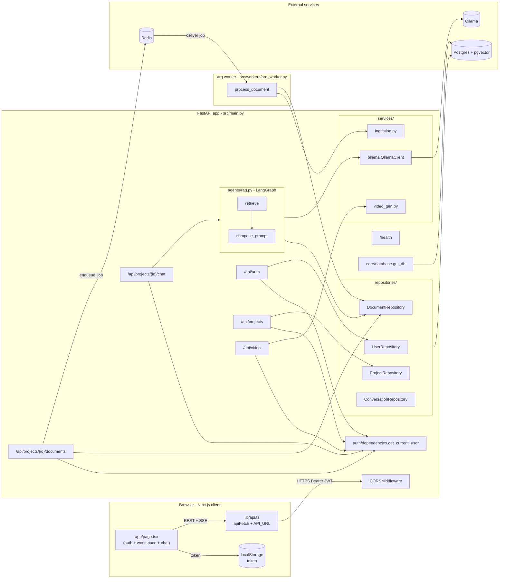
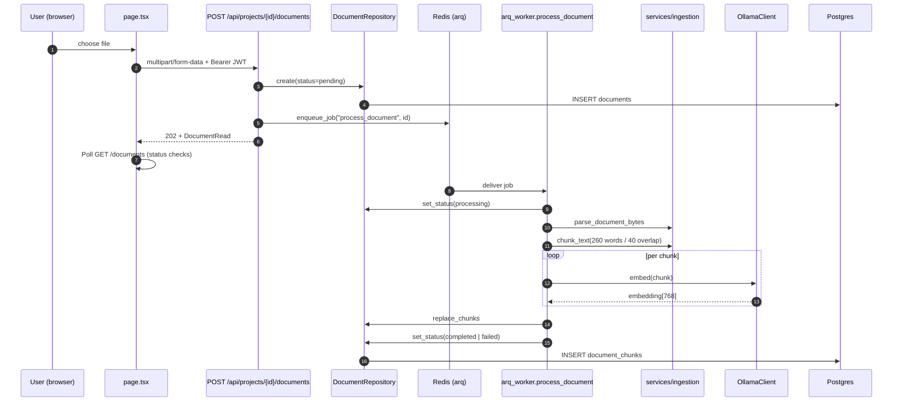
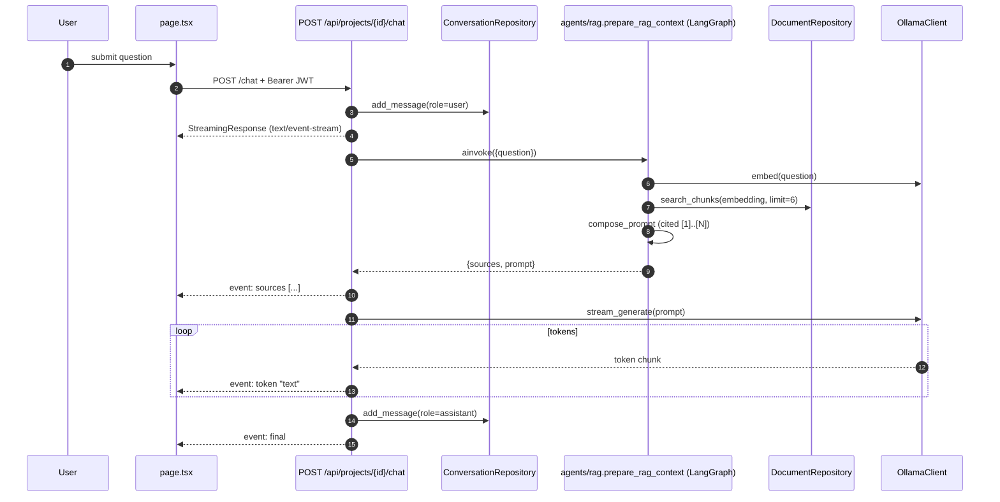

# System Architecture & Technical Design

This document details the high-level system design, relational database models, and critical sequence flows of **Agentic RAG**.

---

## 🏛️ 1. High-Level Architecture

Agentic RAG is organized as a local-first distributed system.

---

## 🗄️ 2. Database Models & Schema Entities

Refer to [docs/database.md](database.md) for full SQLAlchemy schema models and relationships:
* **User**: PBKDF2 hashed credentials, JWT session validation.
* **Project**: Dynamic scoping container for files and chats.
* **Document & DocumentChunk**: Hierarchical parent-child embeddings storage using 768-dimensional `nomic-embed-text` vectors in `pgvector`.
* **Conversation & Message**: Persistent session history storage.

---

## 📡 3. REST & SSE Endpoint Routes

Refer to [docs/api.md](api.md) for detailed descriptions of all FastAPI APIRouter endpoints:
* **/api/auth**: Registration, secure authentication, and profile settings.
* **/api/projects**: Dynamic workspaces scoping per authenticated user session.
* **/api/projects/{id}/documents**: Multi-format async file uploads and processing updates.
* **/api/projects/{id}/chat**: Real-time SSE streaming RAG responses.
* **/api/video**: Remotion-based short-form video generation timeline.

---

## ⚡ 4. Asynchronous Document Ingestion Sequence

Uploads are non-blocking; the API saves metadata, enqueues the job to Arq, and returns immediate acknowledgment.

---

## 💬 5. SSE Chat Generation Sequence

LangGraph orchestrates candidate retrieval, quality gates, and citations before streaming response tokens.

