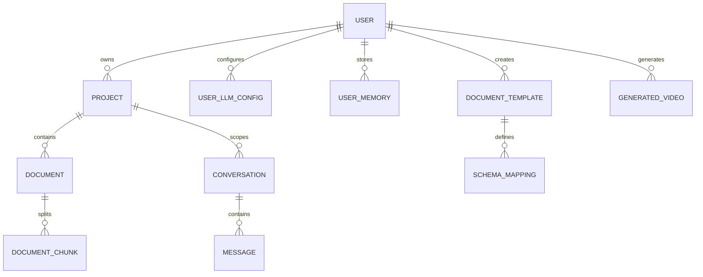

# Database Models & SQLAlchemy Schema

This document details the PostgreSQL schema models, primary/foreign key connections, and pgvector settings of **Artha**.

---

## 1. Entity Relationship Diagram



---

## 2. Detailed Model Schemas

All models live in `backend/src/domain/models.py` as SQLAlchemy 2.0 declarative models.

### User
- **Purpose:** Identity, credentials, and profile.
- **Auth:** Argon2id hashed passwords (`passlib.hash.argon2` — time_cost=3, memory_cost=65536, parallelism=4).
- **Fields:**
  - `id`: UUID (PK, default uuid_generate_v4)
  - `email`: String(255) (Unique, Indexed, NotNull)
  - `hashed_password`: String(255) (NotNull — Argon2id hash)
  - `full_name`: String(255) (Nullable)
  - `created_at`: DateTime (default now())
- **Relationships:** projects, llm_configs, memories, templates, videos

### Project
- **Purpose:** Scoping container for document isolation and chat history.
- **Fields:**
  - `id`: UUID (PK)
  - `owner_id`: UUID (FK → users.id, NotNull)
  - `name`: String(100) (NotNull)
  - `system_prompt`: Text (Nullable — custom system instructions override)
  - `created_at`: DateTime
- **Relationships:** owner, documents (cascade delete), conversations (cascade delete)

### Document
- **Purpose:** File metadata, processing status, and content tracking.
- **Fields:**
  - `id`: UUID (PK)
  - `project_id`: UUID (FK → projects.id, NotNull)
  - `filename`: String(255) (NotNull)
  - `mime_type`: String(100) (NotNull)
  - `file_size`: Integer (NotNull)
  - `sha256`: String(64) (NotNull, Unique — deduplication fingerprint)
  - `status`: Enum(DocumentStatus) — `pending | processing | completed | failed`
  - `error_message`: Text (Nullable — populated on failure)
  - `created_at`: DateTime
- **Indexes:** Unique on `sha256`; composite on `(project_id, status)`
- **Relationships:** project, chunks (cascade delete)

### DocumentChunk
- **Purpose:** Stores semantic vector embeddings for search operations.
- **Fields:**
  - `id`: UUID (PK)
  - `document_id`: UUID (FK → documents.id, NotNull)
  - `chunk_index`: Integer (NotNull — position in document)
  - `parent_chunk_index`: Integer (Nullable — maps child→parent for hierarchical chunking)
  - `content`: Text (NotNull — child chunk content ~80 words)
  - `parent_context`: Text (Nullable — parent chunk ~320 words)
  - `embedding`: Vector(1024) (Indexed — IVFFlat with vector_cosine_ops)
  - `enriched_embedding`: Vector(1024) (Nullable — embedding of content + 3 hypothetical Qs + summary)
  - `created_at`: DateTime
- **Indexes:**
  - IVFFlat on `embedding` (1024d, vector_cosine_ops, lists=100)
  - Trigram GIN index on `content` for pg_trgm similarity search
  - Composite on `(document_id, chunk_index)`
- **Relationships:** document

### Conversation
- **Purpose:** Persist chat session instances.
- **Fields:**
  - `id`: UUID (PK)
  - `project_id`: UUID (FK → projects.id, NotNull)
  - `title`: String(255) (NotNull)
  - `created_at`: DateTime
- **Relationships:** project, messages (cascade delete)

### Message
- **Purpose:** Store discrete dialogue exchanges with citations and feedback.
- **Fields:**
  - `id`: UUID (PK)
  - `conversation_id`: UUID (FK → conversations.id, NotNull)
  - `role`: Enum("user", "assistant") (NotNull)
  - `content`: Text (NotNull)
  - `metadata`: JSON (Nullable — structured source references list)
  - `feedback`: Integer (Nullable — -1 downvote, 1 upvote)
  - `created_at`: DateTime
- **Relationships:** conversation

### UserLLMConfig
- **Purpose:** Per-user BYOK provider configuration.
- **Fields:**
  - `id`: UUID (PK)
  - `user_id`: UUID (FK → users.id, NotNull)
  - `provider`: String(50) (NotNull — e.g., "openai", "anthropic", "groq")
  - `model`: String(100) (NotNull — e.g., "gpt-4o", "claude-3-opus")
  - `api_key`: Text (NotNull — Fernet-encrypted at rest)
  - `base_url`: String(255) (Nullable — for self-hosted/compatible providers)
  - `is_default`: Boolean (default false — one default per user)
  - `created_at`: DateTime
- **Relationships:** user

### UserMemory
- **Purpose:** Cross-session key-value memory with TTL.
- **Fields:**
  - `id`: UUID (PK)
  - `user_id`: UUID (FK → users.id, NotNull)
  - `key`: String(255) (NotNull)
  - `value`: JSONB (NotNull)
  - `type`: String(50) (NotNull — e.g., "fact", "preference", "context")
  - `expires_at`: DateTime (Nullable — TTL support)
  - `created_at`: DateTime
- **Relationships:** user

### DocumentTemplate
- **Purpose:** Reusable ingestion templates with extraction rules.
- **Fields:**
  - `id`: UUID (PK)
  - `user_id`: UUID (FK → users.id, NotNull)
  - `name`: String(255) (NotNull)
  - `schema`: JSON (NotNull — field definitions)
  - `extraction_rules`: JSON (Nullable — LLM extraction prompts)
  - `created_at`: DateTime
- **Relationships:** user, schema_mappings

### SchemaMapping
- **Purpose:** Field-level transformation rules for template-based extraction.
- **Fields:**
  - `id`: UUID (PK)
  - `template_id`: UUID (FK → document_templates.id, NotNull)
  - `source_field`: String(255) (NotNull)
  - `target_field`: String(255) (NotNull)
  - `transform`: String(50) (Nullable — e.g., "lowercase", "date_parse", "llm_extract")
  - `created_at`: DateTime
- **Relationships:** template

### GeneratedVideo
- **Purpose:** Metadata for AI-generated video outputs.
- **Fields:**
  - `id`: UUID (PK)
  - `user_id`: UUID (FK → users.id, NotNull)
  - `status`: Enum("pending", "processing", "completed", "failed")
  - `script`: JSON (Nullable — structured script/scene data)
  - `assets`: JSON (Nullable — generated asset references)
  - `error_message`: Text (Nullable)
  - `created_at`: DateTime
- **Relationships:** user

---

## 3. Vector Index Configuration

```sql
-- IVFFlat index (requires non-empty table to build)
CREATE INDEX IF NOT EXISTS idx_chunks_embedding
  ON document_chunks
  USING ivfflat (embedding vector_cosine_ops)
  WITH (lists = 100);

-- Trigram index for typo-tolerant full-text search
CREATE INDEX IF NOT EXISTS idx_chunks_content_trgm
  ON document_chunks
  USING gin (content gin_trgm_ops);
```

**IVFFlat tradeoffs:**
- Faster build than HNSW (especially on large datasets)
- Lower recall than HNSW at low `lists` values
- `lists = 100` is appropriate for ≤100K rows; increase `lists = sqrt(n_rows)` for larger datasets
- Index must be rebuilt (or recreated) after significant data changes for optimal performance

---

## 4. Initialization

The `infra/init-db.sql` script creates required extensions and indexes:
```sql
CREATE EXTENSION IF NOT EXISTS vector;
CREATE EXTENSION IF NOT EXISTS pg_trgm;
CREATE EXTENSION IF NOT EXISTS pg_bm25;
```

**Must run before `alembic upgrade head`.**

---

## 5. Migrations (Alembic)

All schema changes go through Alembic migrations in `backend/alembic/`.

- **Generate:** `uv run alembic revision --autogenerate -m "description"`
- **Apply:** `uv run alembic upgrade head`
- **Rollback:** `uv run alembic downgrade -1`
