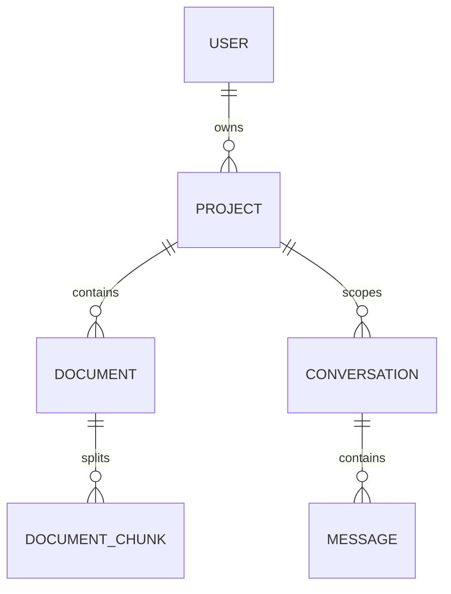

# Database Models & SQLAlchemy Schema

This document details the PostgreSQL schema models, primary/foreign key connections, and pgvector settings of **Agentic RAG**.

---

## 🗄️ 1. Entity Relationship Diagrams

---

## 🏛️ 2. Detailed Model Schemas

### User Model (`src/domain/models.py:User`)
* **Purpose**: Store identity credentials and metadata.
* **Fields**:
  - `id`: `UUID` (Primary Key, default uuid_generate_v4)
  - `email`: `String(255)` (Unique, Indexed, Nullable=False)
  - `hashed_password`: `String(255)` (Null=False, PBKDF2 hashed credentials)
  - `full_name`: `String(255)` (Null=True)
  - `created_at`: `DateTime` (default now())
* **Relationships**:
  - `projects`: `relationship("Project", back_populates="owner", cascade="all, delete-orphan")`

### Project Model (`src/domain/models.py:Project`)
* **Purpose**: Scoping container for document isolation and chat history.
* **Fields**:
  - `id`: `UUID` (Primary Key)
  - `owner_id`: `UUID` (Foreign Key -> `users.id`, Null=False)
  - `name`: `String(100)` (Null=False)
  - `system_prompt`: `Text` (Null=True, custom system instructions override)
  - `created_at`: `DateTime`
* **Relationships**:
  - `owner`: `relationship("User", back_populates="projects")`
  - `documents`: `relationship("Document", back_populates="project", cascade="all, delete-orphan")`
  - `conversations`: `relationship("Conversation", back_populates="project", cascade="all, delete-orphan")`

### Document Model (`src/domain/models.py:Document`)
* **Purpose**: Document metadata, parsing states, and storage details.
* **Fields**:
  - `id`: `UUID` (Primary Key)
  - `project_id`: `UUID` (Foreign Key -> `projects.id`, Null=False)
  - `filename`: `String(255)` (Null=False)
  - `mime_type`: `String(100)` (Null=False)
  - `file_size`: `Integer` (Null=False)
  - `sha256`: `String(64)` (Null=False, unique fingerprint mapping)
  - `status`: `Enum(DocumentStatus)` (`pending`, `processing`, `completed`, `failed`)
  - `error_message`: `Text` (Null=True, populated if worker fails)
  - `created_at`: `DateTime`
* **Relationships**:
  - `project`: `relationship("Project", back_populates="documents")`
  - `chunks`: `relationship("DocumentChunk", back_populates="document", cascade="all, delete-orphan")`

### DocumentChunk Model (`src/domain/models.py:DocumentChunk`)
* **Purpose**: Stores semantic vector embeddings for search operations.
* **Fields**:
  - `id`: `UUID` (Primary Key)
  - `document_id`: `UUID` (Foreign Key -> `documents.id`, Null=False)
  - `chunk_index`: `Integer` (Null=False)
  - `content`: `Text` (Null=False, child chunk content ~60 words)
  - `parent_context`: `Text` (Null=True, larger paragraph/surrounding context)
  - `embedding`: `Vector(768)` (Index vector, nomic-embed-text 768 dimensions)
  - `created_at`: `DateTime`
* **Indexes**:
  - HNSW index on `embedding` using cosine distance.
  - Trigram (`pg_trgm`) index on `content` for typo-tolerant full-text searches.

### Conversation Model (`src/domain/models.py:Conversation`)
* **Purpose**: Persist chat session instances.
* **Fields**:
  - `id`: `UUID` (Primary Key)
  - `project_id`: `UUID` (Foreign Key -> `projects.id`, Null=False)
  - `title`: `String(255)` (Null=False)
  - `created_at`: `DateTime`
* **Relationships**:
  - `project`: `relationship("Project", back_populates="conversations")`
  - `messages`: `relationship("Message", back_populates="conversation", cascade="all, delete-orphan")`

### Message Model (`src/domain/models.py:Message`)
* **Purpose**: Store discrete dialogue exchanges with citations and feedback.
* **Fields**:
  - `id`: `UUID` (Primary Key)
  - `conversation_id`: `UUID` (Foreign Key -> `conversations.id`, Null=False)
  - `role`: `Enum("user", "assistant")` (Null=False)
  - `content`: `Text` (Null=False)
  - `metadata`: `JSON` (Null=True, structured references list)
  - `feedback`: `Integer` (Null=True, -1 for downvote, 1 for upvote)
  - `created_at`: `DateTime`
* **Relationships**:
  - `conversation`: `relationship("Conversation", back_populates="messages")`

---

## ⚙️ 3. Alembic Migrations
Refer to [docs/workflows.md](workflows.md) for applying DB migrations or upgrading to head revision.
