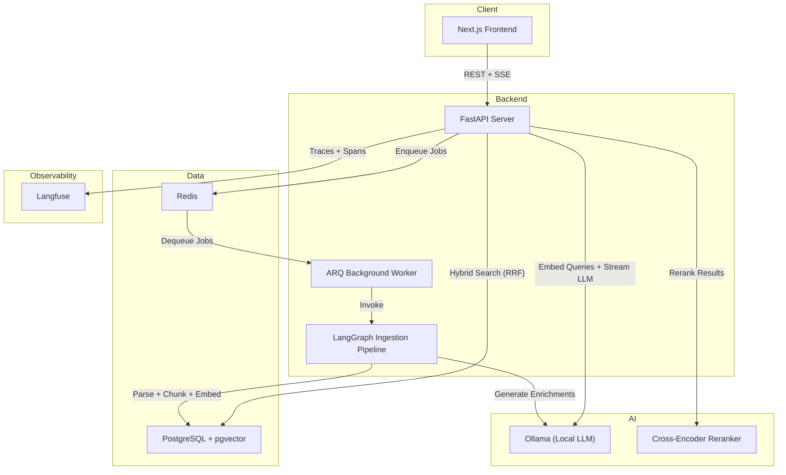
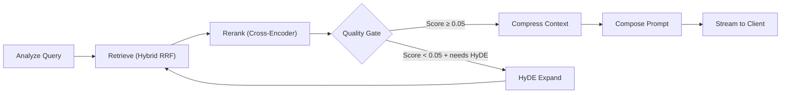

# Artha
**A Local-First, Autonomous RAG Stack**

## a. Quick setup instructions

To get this project running locally on your machine, you'll need Docker, Python 3.12 (`uv`), Bun, and Ollama installed.

1. **Environment files**:
   ```bash
   cp .env.example .env
   cp .env backend/.env
   cp .env frontend/.env
   ```
   Both apps read from their own local `.env`. The `./run.sh` script handles this automatically if you'd rather not do it manually.

2. **Pull models**:
   ```bash
   # ollama pull qwen2.5:3b consumes around 1.8GB to 3.8GB VRAM
   ollama pull gemma4:e4b   # <-- consumes around 2GB to 4GB VRAM
   ollama pull nomic-embed-text
   ```

3. **Spin up infrastructure** (Postgres, Redis, etc.):
   ```bash
   docker compose -f compose.yaml -f compose.dev.yaml up -d
   ```

4. **Backend**:
   ```bash
   cd backend
   uv sync
   uv run alembic upgrade head
   uv run uvicorn src.main:app --reload
   ```

5. **Frontend**:
   ```bash
   cd frontend
   bun install
   bun run dev
   ```

Or just run `./run.sh` from the root and it'll walk you through everything interactively.

---

## b. Architecture overview

The system is intentionally decoupled and local-first — no external API dependencies, no data leaving the machine.

- **Frontend**: Next.js, talking to the backend over REST and SSE for streaming responses.
- **Backend**: FastAPI, structured with Clean Architecture — routers, services, and repositories are separate so you can test the business logic without touching the HTTP layer.
- **Data layer**:
  - **PostgreSQL + pgvector + pg_trgm** — relational metadata, vector embeddings, and trigram indexing all in one place. Keeping vectors and relational data in the same store avoids sync bugs that bite you with a separate vector DB.
  - **Redis** — message broker for background jobs, embedding cache.
- **Background workers**: ARQ. When a document gets uploaded, parsing + chunking + embedding gets handed off to workers immediately so the API doesn't block on a 50-page PDF.
- **Agent orchestration**: LangGraph as a state machine. Rather than a dumb retrieve-then-answer chain, queries get routed, results go through a quality gate, and if confidence is low it loops back with a HyDE expansion before answering. More moving parts, but also more resilient.

### System Topology



### RAG Pipeline (LangGraph State Machine)



---

## c. What would be required to productionize my solution, make it scalable and deploy it on a hyper-scaler such as AWS / GCP / Azure / Cloudflare?

Moving this to AWS would look roughly like:

1. **Compute**: Containerize the FastAPI app and ARQ workers, deploy on ECS Fargate with auto-scaling. Frontend goes on Vercel or Amplify.
2. **Data layer**: Local Postgres → managed RDS with `pgvector` enabled, read replicas for search-heavy workloads. Redis → ElastiCache. Neo4j/AuraDB stays only if the graph layer actually earns its keep — the base `pgvector` pipeline is probably sufficient for most corpora.
3. **Inference**: Ollama is great for local dev but too slow under real load. In production I'd swap to Groq or Together AI for generation and OpenAI/Cohere for embeddings.
4. **File handling**: Right now files hit the disk during ingestion. Pre-signed S3 uploads would let large PDFs go straight to workers without touching the API server.

---

## d. RAG/LLM approach & decisions: Choices considered and final choice for LLM / embedding model / vector database / orchestration framework, prompt & context management, guardrails, quality, observability

- **LLM — Gemma4:e4b via Ollama**: Keeps everything local and the memory footprint low. The tradeoff is synthesis quality — a bigger model will generally do better, but for local evaluation this hits the right balance.
- **Embeddings — nomic-embed-text**: Local, easy to operate, no API dependency. Best embedding model really depends on your corpus, so treat this as a sensible starting point rather than a final answer.
- **Vector DB — pgvector**: One less service to run. Vectors and relational metadata in the same transaction means no sync bugs between two stores.
- **Chunking — hierarchical parent-child**: Small 80-word child chunks for precise retrieval, 320-word parent chunks for context injection. Better recall, but it adds preprocessing complexity and latency.
- **Enriched embeddings**: During ingestion the LLM generates 3 hypothetical questions and a summary per chunk before embedding. Helps recall on paraphrased queries, but it slows down ingestion and adds a dependency on the generator model at index time.
- **Orchestration — LangGraph**: Worth the complexity for query rewriting, HyDE fallback, and confidence-based retries. A straight retrieve-rerank-answer chain is easier to reason about, but loses the fallback behavior.
- **Quality gate — cross-encoder reranker at 0.05**: The threshold is a starting heuristic, not a tuned constant. Calibrate it against a labeled eval set for your corpus before treating it as gospel.

### Evaluation, Observability, Prompting

Things I'd add to make this easier to score and debug:

- **Eval dataset**: ~50 labeled QA pairs covering direct lookup, synthesis, comparison, and questions with no answer in the corpus.
- **Metrics**: Context recall, faithfulness, answer relevance, end-to-end latency broken out by strategy.
- **Observability**: Structured logging and ingestion-stage timing are in place. I'd add explicit OpenTelemetry spans for parsing, chunking, retrieval, reranking, and generation so bottlenecks are visible rather than guessed at. Langfuse covers LLM traces but not the full pipeline.
- **Prompt policy**: Strict system prompt — answer only from retrieved context, cite sources, and say "I don't know" rather than extrapolating when evidence is thin.
- **Context budget**: Make the parent/child chunk sizes and max context window explicit so evaluation results are reproducible.

---

## e. Key technical decisions I made and why

- **Repository pattern**: Routers, services, and repositories are strictly separated. Complex SQL and Cypher queries live in the repository layer, not in HTTP handlers. The main payoff is testability — you can mock the data layer without touching the API contract.
- **Async ingestion**: Document parsing (PDFs, Excel, OCR) gets offloaded to ARQ workers via Redis. Running that synchronously in the FastAPI event loop would block the server under any real load.
- **Hybrid search (RRF)**: Pure vector similarity is brittle on technical documents — exact-match code snippets or slightly misspelled identifiers can fall through the cracks. Reciprocal Rank Fusion blends cosine similarity with Postgres trigram search, which makes retrieval more robust against those edge cases.

### Trade-offs I Made Knowingly

The goal was a solid doc-chat system, not a maximal AI platform. Some choices favor simplicity and local execution over completeness:

- **GraphRAG / Neo4j**: Useful for cross-document entity traversal, but probably overkill unless it demonstrably improves answers over the baseline `pgvector` pipeline. Keeping it optional for now.
- **LangGraph**: The query rewriting and retry loops add orchestration overhead that's harder to explain and evaluate. A simpler pipeline would be easier to debug.
- **Gemma4:e4b**: Memory and setup cost are low, but synthesis quality shows on complex questions. Worth comparing against a larger local model if hardware allows.
- **Quality gate at 0.05**: Chosen conservatively to avoid hallucination when retrieval is weak, not because it's the right number for every dataset.
- **Hierarchical chunking + async ingestion**: Better recall and API responsiveness, at the cost of slower ingestion and more moving parts.

---

## f. Engineering standards I’ve followed (and maybe some that I skipped)

**What I followed:**
- Strict async/await throughout, FastAPI `Depends()` for dependency injection.
- Pydantic schema validation at every API boundary.
- `Ruff` for formatting and static type enforcement.

**What I skipped:**
- Full E2E integration tests. Getting Neo4j and Ollama reliably inside a CI pipeline within a reasonable time budget wasn't worth it here. Unit tests and core service validation cover the important paths.
- External OAuth — local credential hashing keeps the stack fully air-gapped capable.

---

## g. How I used AI tools in my development process

I used Claude Code, Gemini CLI, and Copilot heavily during this build. Here's where they actually helped and where I kept my hands on the wheel:

**What I offloaded to AI:**
- Initial SQLAlchemy models, Pydantic schemas, Alembic migration scripts, and multi-provider LLM client adapters. High-volume, pattern-heavy files where the structure is obvious and the risk is low.
- Structured docstrings across repositories and services. I defined the format (Purpose / Responsibilities / Inputs / Outputs / Flow) and had AI apply it consistently rather than writing each one by hand.
- Initial shadcn/ui component wrappers, landing page sections, CSS scaffolding — refined manually afterward.
- Test scaffolding: fixtures and mocking patterns. I wrote the actual assertions and edge cases myself.

**Where I kept control:**
- **Architecture**: The LangGraph state machine, the RRF hybrid search approach, the enriched embedding strategy — those are mine. I don't trust AI to make architectural decisions because it optimizes for "plausible" rather than "correct for this specific system."
- **Security code**: The SSRF guard, Fernet encryption, JWT validation, rate limiting — all written and reviewed by hand. AI-generated security code looks right until it isn't.
- **Every line got read**: I caught several places where AI used synchronous Redis calls in async contexts and generated overly broad exception handlers that would have swallowed errors silently.
- **`.ai/` rule files**: I kept markdown files describing the project's patterns, conventions, and constraints (`.ai/architecture.md`, `.ai/coding-standards.md`). This makes AI output context-aware across sessions instead of generic boilerplate that doesn't fit the codebase.

**Rules I follow:**
- ✅ Use AI for repetitive CRUD, serialization, and adapter patterns
- ✅ Give AI project context so output matches the codebase style
- ✅ Read every line before committing
- ❌ Don't let AI make architectural decisions
- ❌ Don't trust AI-generated security code without manual review
- ❌ Don't accept "improvements" that add abstraction without clear value

---

## h. What I'd do differently with more time

1. **Retrieval benchmarking**: Actually measure the reranker's impact on answer quality instead of going on intuition.
2. **Eval in CI**: Turn the labeled QA set into automated checks so context recall, faithfulness, and latency regressions get caught on every PR.
3. **Observability**: OpenTelemetry spans for every pipeline stage — ingestion, retrieval, reranking, generation — so bottlenecks are data, not guesswork.
4. **Prompt and context strategy**: Formalize the system prompt, citation format, and context budget so model behavior is predictable and evaluation is repeatable.
5. **GraphRAG decision**: Run a real A/B on cross-document questions with and without Neo4j. If it doesn't move the needle, remove it.
6. **Model sizing**: Find the smallest local model that gives acceptable synthesis quality for the target hardware budget, rather than defaulting to 3B.
