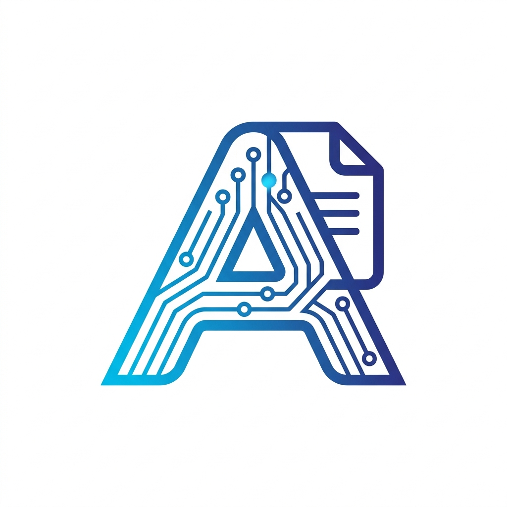
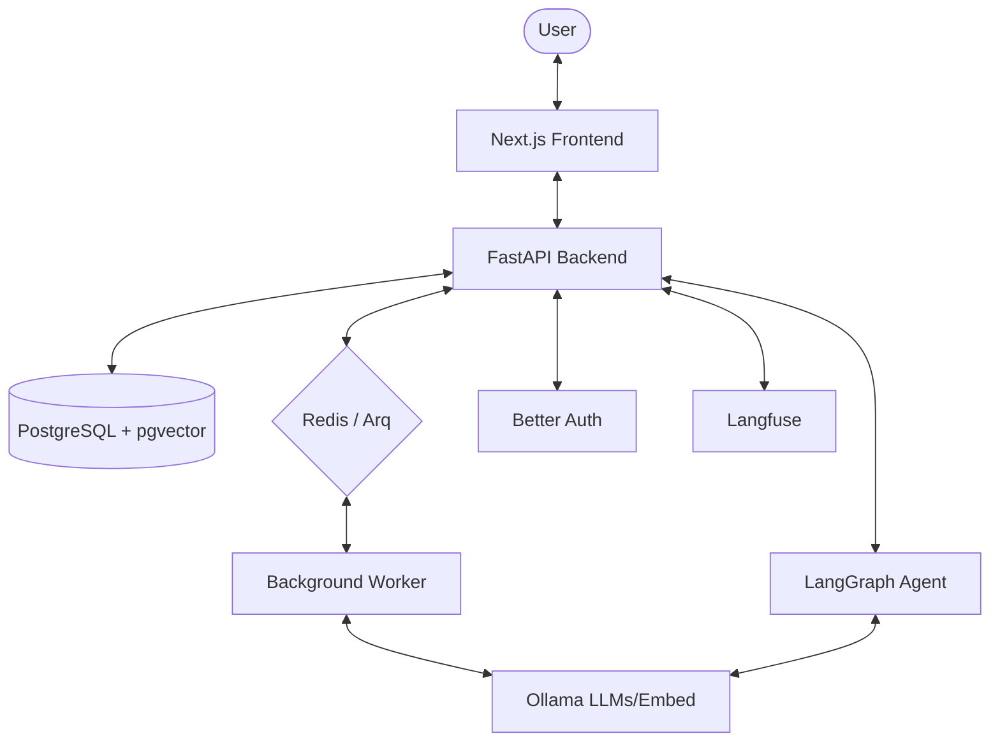

<div align="center">
  
  <h1>Agentic RAG</h1>
  <p><strong>A Local-First, Autonomous Agentic Retrieval-Augmented Generation Stack</strong></p>

  [](https://fastapi.tiangolo.com/)
  [](https://nextjs.org/)
  [](https://langchain-ai.github.io/langgraph/)
  [](https://ollama.com/)
  [](https://www.docker.com/)
  [](https://bun.sh/)
</div>

---

<p align="center">
  
</p>

## 🌟 Overview

**Agentic RAG** is a state-of-the-art, local-first stack designed for building production-ready RAG applications with autonomous reasoning capabilities. By combining the power of **LangGraph** for orchestration and **Ollama** for local inference, it provides a secure, private, and highly customizable environment for your data.

### Why Agentic RAG?
- **Privacy First**: Everything runs locally. No data leaves your infrastructure.
- **Autonomous Reasoning**: Agents can self-correct, plan, and refine their search strategies.
- **Production Ready**: Full observability with Langfuse and robust auth with Better Auth.
- **Blazing Performance**: Powered by Bun, FastAPI, and Redis-backed background workers.

---

## ✨ Key Features

| Feature | Description |
| :--- | :--- |
| **🤖 Agentic Orchestration** | Powered by **LangGraph**, enabling complex multi-step reasoning, self-correction, and planning. |
| **🏠 Local-First** | Native support for **Ollama**, allowing you to use Qwen, Llama, and Nomic Embed locally. |
| **⚡ Async Processing** | Redis and **Arq** workers handle heavy document ingestion and vectorization in the background. |
| **🔍 Vector Search** | Leveraging **pgvector** in PostgreSQL for high-performance semantic retrieval. |
| **🎨 Modern UI** | A sleek, responsive dashboard built with **Next.js 14**, **Bun**, and **Shadcn UI**. |
| **🛡️ Secure & Observable** | Integrated **Better Auth** and **Langfuse** for enterprise-grade management. |

---

## 🏗️ Architecture



---

## 🚀 Quick Start (Docker)

The easiest way to get up and running is using the interactive launcher script [run.sh](./run.sh). It automatically performs essential pre-checks (Docker daemon status, `.env` file presence, Ollama connectivity, and model availability), starts services, and runs database migrations.

### Interactive Startup
```bash
./run.sh
```

Menu options:
- **Option 1**: Start Stack (Build + Migrations + Logs)
- **Option 2**: Start Stack with Dev Tools (RedisInsight for Redis GUI at `http://localhost:8001`)
- **Option 3-9**: Stop, Restart, Status, Logs, Migrations, Clean, Exit

Choose **Option 1** to start the stack, wait for services to be healthy, and automatically run database migrations.

---

### Launcher CLI Reference
You can bypass the menu by passing commands directly to the script:
- **Start Stack**: `./run.sh up` (or `./run.sh up --build` to rebuild)
- **Stop Stack**: `./run.sh down`
- **Restart Stack**: `./run.sh restart`
- **Check Status**: `./run.sh status`
- **Tail Logs**: `./run.sh logs` (or `./run.sh logs backend` for a specific service)
- **Migrate Database**: `./run.sh migrate`
- **Deep Clean Stack**: `./run.sh clean` (removes containers and volumes for a fresh start)

---

### Manual Launch (Without Script)
If you prefer running raw Docker Compose commands:

1. **Environment Setup**:
   ```bash
   cp .env.example .env
   ```

2. **Prepare Local LLMs (Ollama)**:
   Ensure [Ollama](https://ollama.com) is running on your host machine:
   ```bash
   ollama pull qwen2.5:3b
   ollama pull nomic-embed-text
   ```

3. **Launch Stack**:
   ```bash
   docker compose up --build -d
   ```

4. **Database Initialization**:
   ```bash
   docker compose exec backend alembic upgrade head
   ```

**Services:**
- **Frontend**: [http://localhost:3000](http://localhost:3000)
- **Backend API**: [http://localhost:8000](http://localhost:8000)
- **Langfuse**: [http://localhost:3001](http://localhost:3001)

---

## 🛠️ Master Documentation System

For comprehensive guides on codebase architecture, programming standards, workflows, and frontend/backend configurations, check our dedicated documentation modules:

- [🏛️ **System Architecture**](./docs/architecture.md) — High-level designs, database models, and chat/ingestion sequence diagrams.
- [⚛️ **Frontend Developer Guide**](./docs/frontend.md) — Next.js v16.2 App Router, Server Components split, Server Actions, and loading boundaries.
- [🐍 **Backend Developer Guide**](./docs/backend.md) — FastAPI standards, service-repository patterns, pgvector RAG pipeline, and Remotion video synthesis.
- [📐 **Style Guides & Standards**](./docs/standards.md) — Coding conventions, variable suffixes, state hierarchy, API contracts, testing metrics, and error boundaries.
- [🔧 **Workflows & Runbook**](./docs/workflows.md) — Worker job queues, Alembic migrations lifecycle, CLI reference, configuration, and observability.
- [🔍 **Troubleshooting Guide**](./docs/troubleshooting.md) — Docker link failures, local model fetching, Redis task queues, and migration debugging.
- [🗺️ **Project Roadmap**](./docs/roadmap.md) — Phase 1, 2, and 3 engineering milestones.


### Prerequisites
- Python `3.12+` with `uv`
- Bun `1.0+`
- PostgreSQL `16+` with `pgvector`
- Redis `7+`

---

## 📂 Project Structure

```text
.
├── backend/            # FastAPI API & Arq Workers
│   ├── alembic/        # DB Migrations
│   ├── src/            # Core logic, agents, and API
│   └── tests/          # Pytest suite
├── frontend/           # Next.js Application
│   ├── src/            # Components, Hooks, and App Router
│   └── public/         # Static assets
├── infra/              # Infrastructure configurations
├── docs/               # Documentation & Assets
├── docker-compose.yml  # Orchestration
└── .env.example        # Template configuration
```

---

## 🤝 Contributing

We welcome contributions! Please see our [Contributing Guide](CONTRIBUTING.md) for more details.

## 📄 License

This project is licensed under the MIT License - see the [LICENSE](LICENSE.md) file for details.

---

<p align="center">Built with ❤️ by the Agentic RAG Team</p>
