# Backend Router Architecture Diagram

## Detailed Router-Level Dependencies

```mermaid
graph TD
    main["main.py<br/>FastAPI App<br/>Router Registration"]
    
    subgraph "Core Dependencies"
        getdb["get_db()<br/>AsyncSession"]
        getcurrentuser["get_current_user()<br/>User Dependency"]
        limiter["limiter<br/>Rate Limiting"]
        settings["get_settings()<br/>Config"]
    end
    
    subgraph "Auth Router [/api/auth]"
        auth_router["auth.py<br/>router"]
        auth_register["POST /register<br/>register()"]
        auth_login["POST /login<br/>login()"]
        auth_me["GET /me<br/>me()"]
        auth_update["PATCH /me<br/>update_me()"]
        
        auth_router --> auth_register
        auth_router --> auth_login
        auth_router --> auth_me
        auth_router --> auth_update
        
        auth_register --> getdb
        auth_register --> limiter
        auth_login --> getdb
        auth_login --> limiter
        auth_me --> getcurrentuser
        auth_update --> getcurrentuser
        auth_update --> getdb
    end
    
    subgraph "Auth Dependencies"
        userrepo["UserRepository<br/>get_by_email()<br/>create()<br/>update()"]
        authsecurity["auth/security<br/>hash_password()<br/>verify_password()<br/>create_access_token()"]
    end
    
    auth_register --> userrepo
    auth_register --> authsecurity
    auth_login --> userrepo
    auth_login --> authsecurity
    auth_update --> userrepo
    
    subgraph "Projects Router [/api/projects]"
        projects_router["projects.py<br/>router"]
        proj_list["GET /<br/>list_projects()"]
        proj_create["POST /<br/>create_project()"]
        proj_update["PATCH /{id}<br/>update_project()"]
        proj_delete["DELETE /{id}<br/>delete_project()"]
        
        projects_router --> proj_list
        projects_router --> proj_create
        projects_router --> proj_update
        projects_router --> proj_delete
        
        proj_list --> getcurrentuser
        proj_list --> getdb
        proj_create --> getcurrentuser
        proj_create --> getdb
        proj_update --> getcurrentuser
        proj_update --> getdb
        proj_delete --> getcurrentuser
        proj_delete --> getdb
    end
    
    subgraph "Project Dependencies"
        projectrepo["ProjectRepository<br/>list_for_user()<br/>get_for_user()<br/>create()<br/>update()<br/>delete()"]
    end
    
    proj_list --> projectrepo
    proj_create --> projectrepo
    proj_update --> projectrepo
    proj_delete --> projectrepo
    
    subgraph "Documents Router [/api/projects/{id}/documents]"
        docs_router["documents.py<br/>router"]
        docs_list["GET /<br/>list_documents()"]
        docs_upload["POST /<br/>upload_document()"]
        
        docs_helper_ensure["_ensure_project()<br/>Helper"]
        docs_helper_validate["_validate_upload_file()<br/>Helper"]
        
        docs_router --> docs_list
        docs_router --> docs_upload
        docs_router --> docs_helper_ensure
        docs_router --> docs_helper_validate
        
        docs_list --> getcurrentuser
        docs_list --> getdb
        docs_list --> docs_helper_ensure
        docs_upload --> getcurrentuser
        docs_upload --> getdb
        docs_upload --> docs_helper_ensure
        docs_upload --> docs_helper_validate
    end
    
    subgraph "Documents Dependencies"
        docrepo["DocumentRepository<br/>list_for_project()<br/>create()<br/>set_status()<br/>replace_chunks()"]
        ingestion["services/ingestion<br/>sha256_bytes()"]
        redis["Redis/Arq<br/>create_pool()<br/>enqueue_job()"]
    end
    
    docs_list --> docrepo
    docs_upload --> docrepo
    docs_upload --> ingestion
    docs_upload --> redis
    docs_helper_ensure --> projectrepo
    
    subgraph "Conversations Router [/api/projects/{id}/conversations]"
        conv_router["conversations.py<br/>router"]
        conv_list["GET /<br/>list_conversations()"]
        conv_get["GET /{id}<br/>get_conversation()"]
        conv_helper["_ensure_project()<br/>Helper"]
        
        conv_router --> conv_list
        conv_router --> conv_get
        conv_router --> conv_helper
        
        conv_list --> getcurrentuser
        conv_list --> getdb
        conv_list --> conv_helper
        conv_get --> getcurrentuser
        conv_get --> getdb
        conv_get --> conv_helper
    end
    
    subgraph "Conversations Dependencies"
        convrepo["ConversationRepository<br/>list_for_project()<br/>get_for_project()<br/>create()<br/>add_message()"]
    end
    
    conv_list --> convrepo
    conv_get --> convrepo
    conv_helper --> projectrepo
    
    subgraph "Chat Router [/api/projects/{id}/chat]"
        chat_router["chat.py<br/>router"]
        chat_post["POST /<br/>chat()<br/>SSE Streaming"]
        chat_feedback["POST /messages/{id}/feedback<br/>post_message_feedback()"]
        
        chat_post_helper["stream()<br/>Async Generator<br/>_event() formatter"]
        
        chat_router --> chat_post
        chat_router --> chat_feedback
        chat_post --> chat_post_helper
        
        chat_post --> getcurrentuser
        chat_post --> getdb
        chat_post --> limiter
        chat_feedback --> getcurrentuser
        chat_feedback --> getdb
    end
    
    subgraph "Chat Dependencies"
        ollamaclient["OllamaClient<br/>embed()<br/>stream_generate()<br/>close()"]
        ragagent["agents/rag<br/>prepare_rag_context()"]
        msgrepo["MessageRepository<br/>get_for_project()<br/>update_feedback()"]
    end
    
    chat_post --> projectrepo
    chat_post --> convrepo
    chat_post --> ragagent
    chat_post --> ollamaclient
    chat_post_helper --> ollamaclient
    chat_feedback --> projectrepo
    chat_feedback --> msgrepo
    
    subgraph "Health Router [/health]"
        health_router["health.py<br/>router"]
        health_check["GET /<br/>healthcheck()"]
        health_ready["GET /ready<br/>readiness_check()"]
        
        health_helper_db["check_database()"]
        health_helper_redis["check_redis()"]
        health_helper_ollama["check_ollama()"]
        
        health_router --> health_check
        health_router --> health_ready
        health_ready --> health_helper_db
        health_ready --> health_helper_redis
        health_ready --> health_helper_ollama
    end
    
    subgraph "Health Dependencies"
        sqlengine["SQLAlchemy<br/>Engine"]
        redisclient["Redis Client"]
        httpxclient["httpx<br/>AsyncClient"]
    end
    
    health_helper_db --> sqlengine
    health_helper_redis --> redisclient
    health_helper_ollama --> httpxclient
    health_helper_ollama --> settings
    
    main --> auth_router
    main --> projects_router
    main --> docs_router
    main --> conv_router
    main --> chat_router
    main --> health_router
    
    main --> getdb
    main --> getcurrentuser
    main --> limiter
    main --> settings
    
    style main fill:#ff6b6b
    style auth_router fill:#4ecdc4
    style projects_router fill:#45b7d1
    style docs_router fill:#96ceb4
    style conv_router fill:#ffeaa7
    style chat_router fill:#dfe6e9
    style health_router fill:#a29bfe
```



## Endpoint Summary by Router

### Auth Router (`/api/auth`)
| Endpoint | Method | Auth | Rate Limit | Key Dependencies |
|----------|--------|------|-----------|-----------------|
| `/register` | POST | ❌ | 5/min | UserRepository, hash_password, create_access_token |
| `/login` | POST | ❌ | 10/min | UserRepository, verify_password, create_access_token |
| `/me` | GET | ✅ | - | get_current_user |
| `/me` | PATCH | ✅ | - | UserRepository, get_current_user |

### Projects Router (`/api/projects`)
| Endpoint | Method | Auth | Key Dependencies |
|----------|--------|------|-----------------|
| `/` | GET | ✅ | ProjectRepository.list_for_user() |
| `/` | POST | ✅ | ProjectRepository.create() |
| `/{id}` | PATCH | ✅ | ProjectRepository.update() |
| `/{id}` | DELETE | ✅ | ProjectRepository.delete() |

### Documents Router (`/api/projects/{id}/documents`)
| Endpoint | Method | Auth | Key Dependencies |
|----------|--------|------|-----------------|
| `/` | GET | ✅ | DocumentRepository.list_for_project() |
| `/` | POST | ✅ | DocumentRepository.create(), Redis Arq enqueue_job, _validate_upload_file() |

**Important:** Upload triggers `process_document()` Arq worker in background.

### Conversations Router (`/api/projects/{id}/conversations`)
| Endpoint | Method | Auth | Key Dependencies |
|----------|--------|------|-----------------|
| `/` | GET | ✅ | ConversationRepository.list_for_project() |
| `/{id}` | GET | ✅ | ConversationRepository.get_for_project() |

### Chat Router (`/api/projects/{id}/chat`)
| Endpoint | Method | Auth | Rate Limit | Response Type | Key Dependencies |
|----------|--------|------|-----------|---------------|-----------------|
| `/` | POST | ✅ | 20/min | SSE Stream | prepare_rag_context(), OllamaClient.stream_generate() |
| `/messages/{id}/feedback` | POST | ✅ | - | JSON | MessageRepository.update_feedback() |

**Streaming Events:**
- `conversation`: Conversation metadata
- `sources`: Retrieved document chunks
- `token`: Individual LLM tokens (streamed)
- `final`: Final message object
- `error`: Error details

### Health Router (`/health`)
| Endpoint | Method | Auth | Returns |
|----------|--------|------|---------|
| `/` | GET | ❌ | `{"status": "ok"}` |
| `/ready` | GET | ❌ | Readiness probe with DB, Redis, Ollama checks |

## Data Flow Example: Chat Request

```
Browser
  ↓ POST /api/projects/{id}/chat
FastAPI Router (chat.py)
  ↓ Validates auth (get_current_user)
  ↓ Validates project (ProjectRepository.get_for_user)
  ↓ Manages conversation (ConversationRepository.get_for_project OR create)
  ↓ Stores user message (ConversationRepository.add_message)
  ↓ Returns StreamingResponse (SSE)
    ↓ invoke prepare_rag_context (agents/rag.py)
      ↓ OllamaClient.embed(question)
      ↓ DocumentRepository.search_chunks(embedding)
      ↓ Returns sources + formatted prompt
    ↓ invoke OllamaClient.stream_generate(prompt)
      ↓ Streams tokens via _event("token", ...)
    ↓ Store assistant message (ConversationRepository.add_message)
    ↓ Emit final event with message_id
Browser receives SSE events and renders streaming response
```

## Data Flow Example: Document Upload

```
Browser
  ↓ POST /api/projects/{id}/documents (multipart file)
FastAPI Router (documents.py)
  ↓ Validates auth
  ↓ Validates project
  ↓ Validates file (_validate_upload_file)
  ↓ Creates document record (DocumentRepository.create, status=pending)
  ↓ Returns 202 Accepted + DocumentRead
  ↓ Enqueues job (Redis/Arq enqueue_job("process_document", doc_id))
Returns immediately to browser

Background: Arq Worker
  ↓ Receives process_document job
  ↓ Fetches document (DocumentRepository.get)
  ↓ Sets status=processing
  ↓ Parses bytes (services/ingestion.parse_document_bytes)
  ↓ Chunks text (services/ingestion.chunk_text_hierarchical)
  ↓ Embeds chunks (OllamaClient.embed per chunk)
  ↓ Stores chunks (DocumentRepository.replace_chunks)
  ↓ Sets status=completed OR failed

Frontend polls GET /api/projects/{id}/documents until status changes
```
