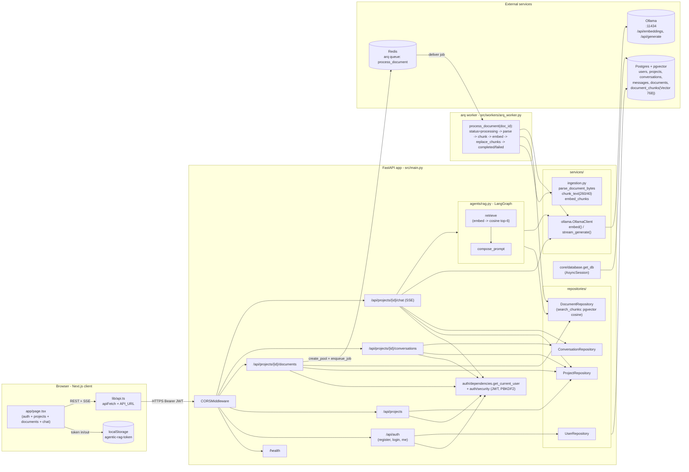
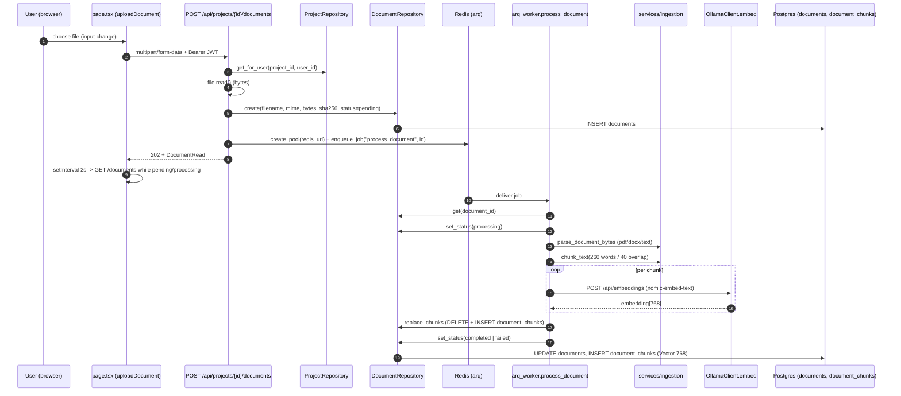
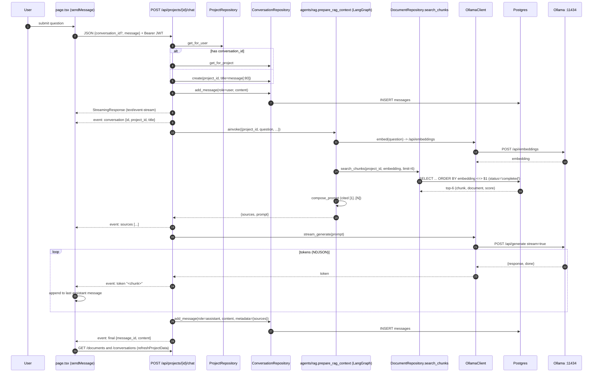

# Application Flow & Data Flow

Mermaid diagrams of the agentic-RAG application, verified against the source. Every node and arrow corresponds to specific code paths listed in the verification section at the bottom.

## 1. System architecture & data flow

## 2. Document upload + ingestion (sequence)

## 3. Chat / RAG streaming (sequence)

## Verification — every claim maps to source

- Routers + CORS: `backend/src/main.py:18-34`.
- JWT + PBKDF2: `backend/src/auth/security.py:11-50`; bearer dep `backend/src/auth/dependencies.py:12-32`.
- Frontend token storage + SSE parser: `frontend/app/page.tsx:35,42-53,170,260-295`; streaming endpoint hit at `:245`.
- Document upload enqueue: `backend/src/routers/documents.py:48-68` (uses `arq.create_pool` + `enqueue_job("process_document", ...)`).
- Worker pipeline: `backend/src/workers/arq_worker.py:19-43` (parse -> chunk -> embed -> `replace_chunks` -> `set_status`).
- Ingestion: `backend/src/services/ingestion.py:42-89` (PDF via `pypdf`, DOCX via `ZipFile`+XML, text fallback; `chunk_words=260`, `overlap_words=40`).
- Ollama client paths/models: `backend/src/services/ollama.py:14-47`; defaults `nomic-embed-text` / `qwen2.5:3b` in `backend/src/core/config.py:13-17`.
- LangGraph two-node (retrieve -> compose_prompt): `backend/src/agents/rag.py:25-66`; cosine search with `status="completed"` + `limit=6`: `backend/src/repositories/documents.py:87-101`.
- Vector schema (`Vector(768)` + ivfflat cosine index): `backend/src/domain/models.py:159-173`.
- SSE event names emitted (`conversation`, `sources`, `token`, `final`, `error`): `backend/src/routers/chat.py:56-81` — exactly the names handled by the client at `frontend/app/page.tsx:274-293`.
- Infra (Postgres+pgvector, Redis, Ollama, Langfuse): `docker-compose.yml:2-130`; `infra/init-db.sql:1` (`CREATE EXTENSION vector`).
