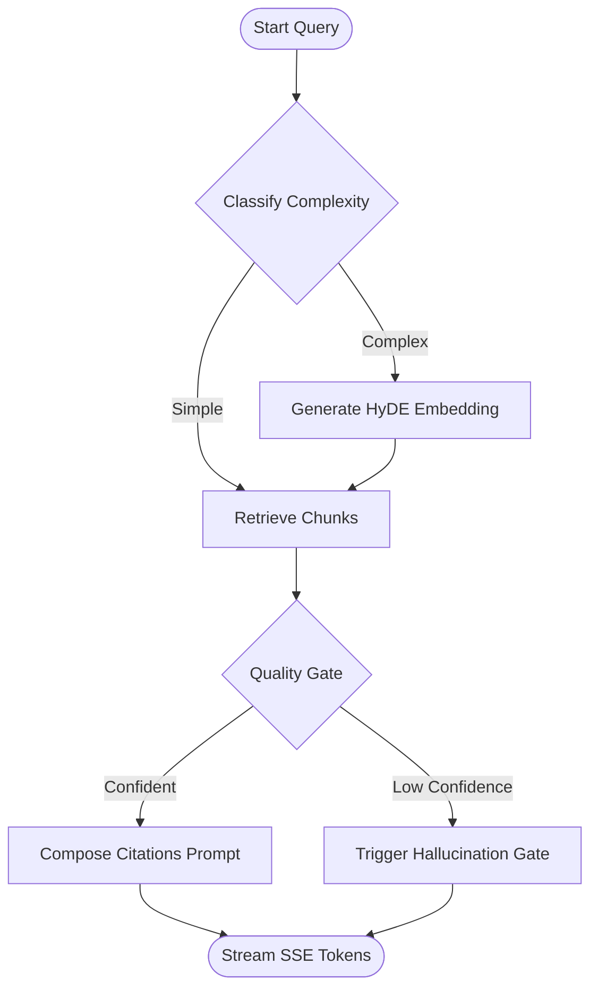

# RAG Pipeline, Hybrid Search & LangGraph Orchestration

This document details the retrieval algorithms, parent-child expanding context strategy, and LangGraph agent structures of the **Agentic RAG** pipeline.

---

## 🔍 1. Hybrid Search & Reciprocal Rank Fusion (RRF)

To achieve robust search recall under local hardware constraints, retrieval combines vector similarity with typo-tolerant keyword matching.

```
                  ┌──> Vector Search (pgvector cosine) ──> Top-K Candidates
                  │                                             │
Question/Query ───┤                                             ├──> RRF Merging & Reranking ──> Cited Prompt Context
                  │                                             │
                  └──> Trigram Search (pg_trgm keyword) ──> Top-K Candidates
```

### pgvector Cosine Search
- **Embedding Model**: `nomic-embed-text` (768-dimensions) loaded locally in Ollama.
- **Data column**: `DocumentChunk.embedding` (Vector 768).
- **Execution**: Computes distance metrics dynamically via cosine similarity:
  `ORDER BY embedding <=> :query_embedding`

### Trigram FTS Keyword Search
- PostgreSQL trigram indexes (`pg_trgm` extension) match substrings on the chunk `content` field.
- **Benefit**: Immune to typical spelling typos that vector models might misinterpret.

### Reciprocal Rank Fusion (RRF)
RRF combines candidate ranks from both vector and keyword passes to compute a unified rank score:
$$RRF(d) = \sum_{m \in M} \frac{1}{k + r_m(d)}$$
* Where $r_m(d)$ is the rank of document $d$ in search pass $m$, and $k$ is a smoothing constant (typically $60$).

---

## 📄 2. Hierarchical Chunking (Parent-Child Strategy)

- **The Tradeoff**: Large text blocks provide rich context to LLMs but have poor semantic density (hard to retrieve). Small text blocks have high semantic density but lack context for generation.
- **Our Strategy**:
  1. **Child Chunks**: The ingestion engine splits texts into small chunks (~60 words, 40-word overlap). We embed these child chunks and save them in the vector database.
  2. **Parent Chunks**: We extract and map the larger paragraph surrounding context (the parent) to the child chunks.
  3. **Execution**: The hybrid query retrieves relevant child chunks, but the prompt composer substitutes them with their parent context before passing them to the generator. This ensures high retrieval precision while delivering rich context for generation.

---

## 🤖 3. LangGraph Agent Pipeline

The RAG pipeline is orchestrated as a state-driven graph (`StatefulGraph`) inside `src/agents/rag.py`:



### Graph Nodes Lifecycle
1. **classify_query_complexity**: Evaluates query length and keywords. Routes simple queries directly, while routing abstract queries through a HyDE (Hypothetical Document Embeddings) generation pass.
2. **retrieve**: Executes hybrid pgvector search to extract top candidates.
3. **quality_gate**: Checks score thresholds. If scores are too low, redirects prompt paths to prevent hallucination.
4. **compose_prompt**: Prepares context blocks, mapping them to explicit citations (`[1]..[N]`).
